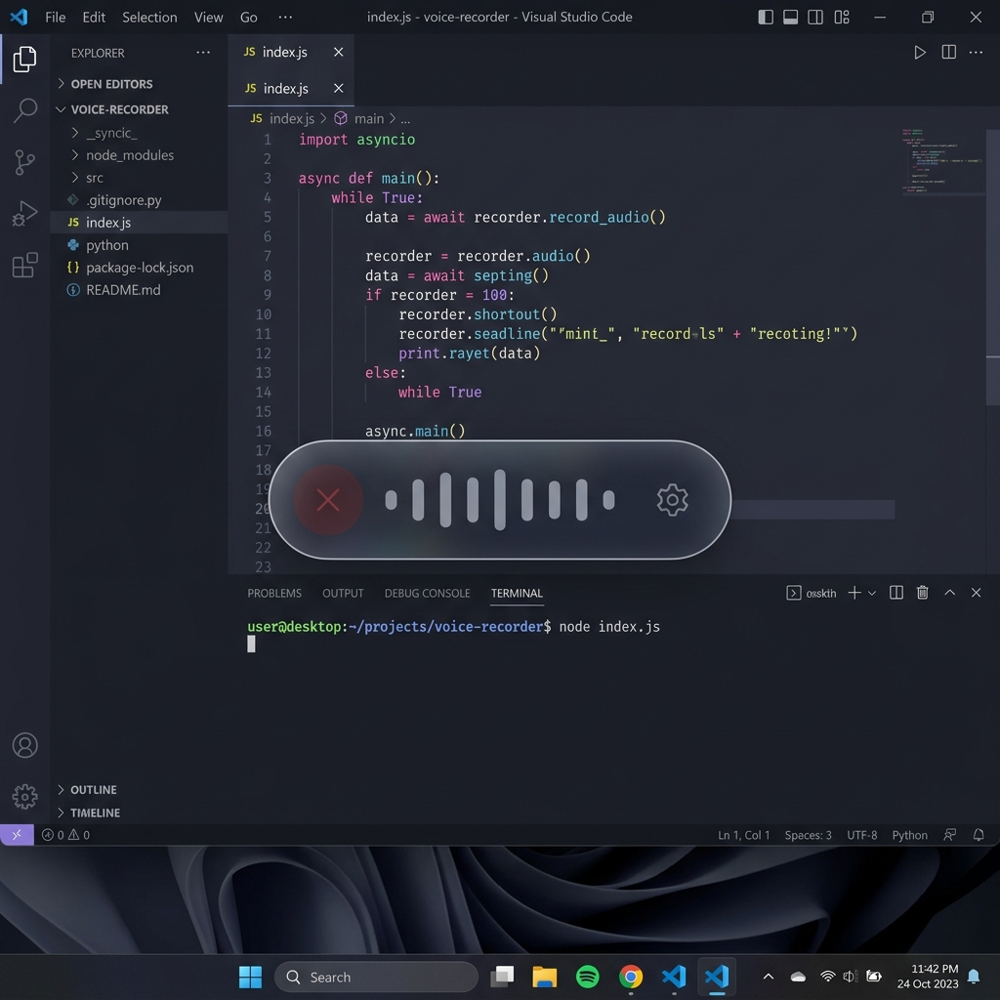
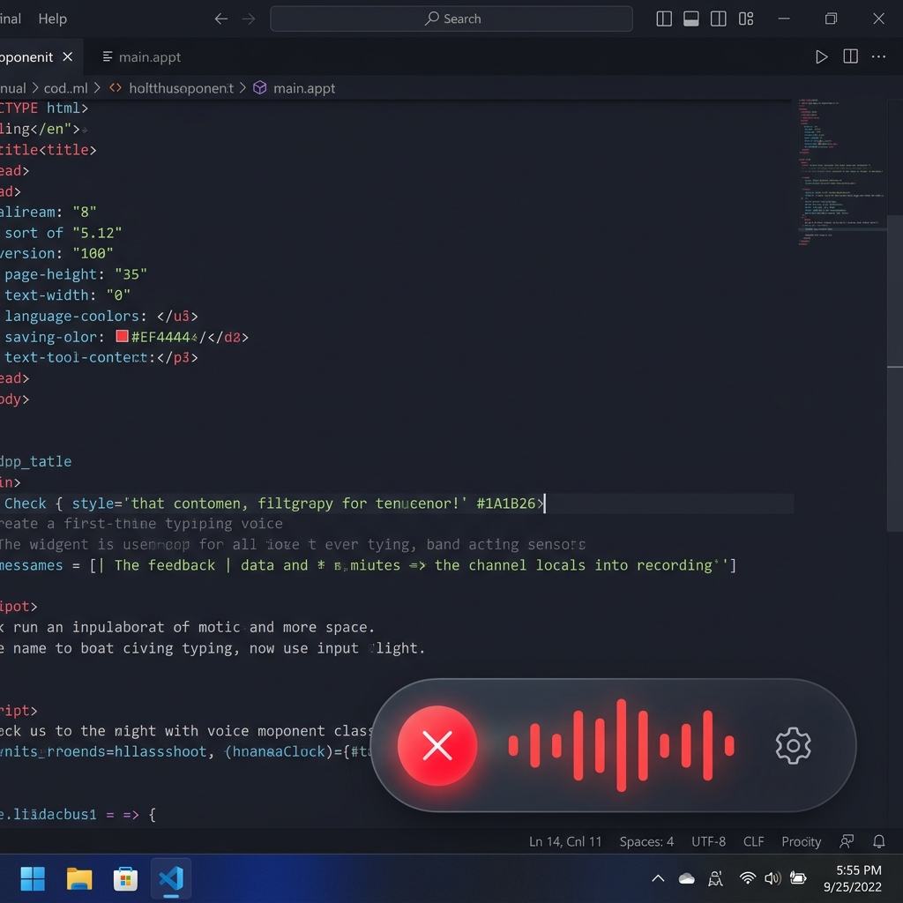
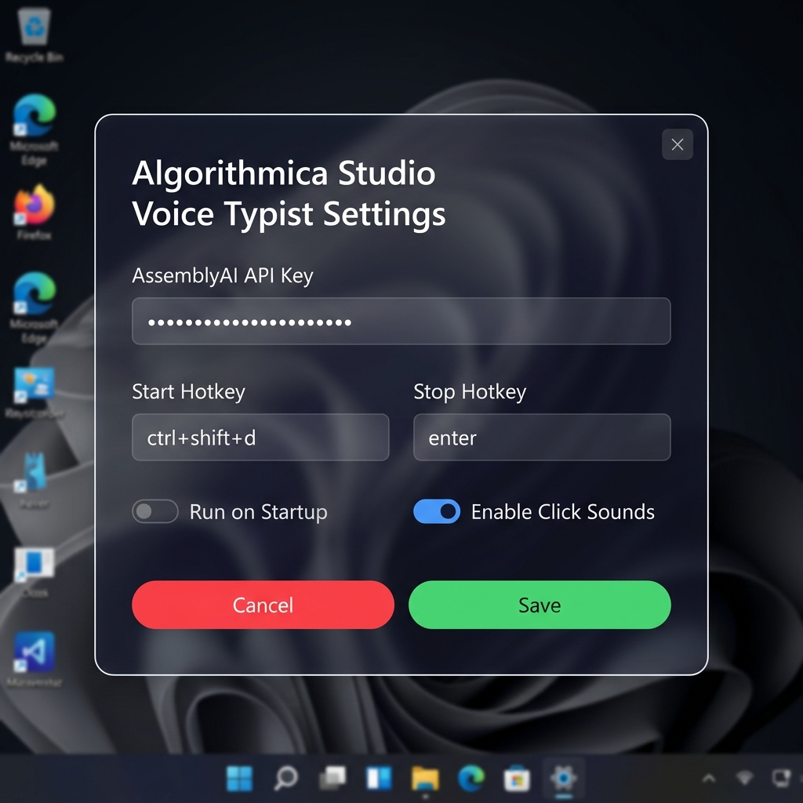

# Voice Typist — Algorithmica Studio

**Speak anywhere. Get typed text anywhere.**

Voice Typist is an ultra-lightweight, glassmorphic voice typing capsule widget for Windows. It floats on top of your workspace, records your speech, transcribes it instantly using the AssemblyAI API, and pastes it directly at your active cursor — without stealing focus from what you're working in.

## Features

- 💊 **Minimalist Status Pill**: A tiny, borderless capsule (`190x36px`) that stays on top, fades translucent when inactive, and is fully draggable.
- 🌊 **Siri-like Waveform**: An animated, 9-bar voice visualizer that dances dynamically in response to your microphone input.
- ⌨️ **Global Key Bindings**: Press `Ctrl + Shift + D` to start recording, and `Enter` to transcribe and paste. No focus is lost.
- ❌ **Dynamic Cancel Button**: Discard a bad recording instantly by pressing `Esc` or clicking the cancel button `❌` on the capsule.
- ⚙️ **Frameless Glassmorphic Settings Dialog**: A customized settings window featuring drag-and-drop support, close button, and a **Press-to-Capture key recorder** to configure custom shortcut keys easily.
- 🔌 **Run on Startup**: Automatically register a startup shortcut in Windows via a settings checkbox so Voice Typist runs silently in the background on PC boot.
- 🔊 **Sound Clicks**: Premium mechanical "tick-tack" key click indicators to guide you when recording starts, stops, or completes. Can be toggled on/off.

---

## Screenshots

| Idle | Recording | Settings |
|:---:|:---:|:---:|
|  |  |  |

---

## Installation & Setup

### Prerequisites
- Windows 10/11
- Python 3.12+ (A virtual environment setup script is included)
- An **AssemblyAI API Key** (Get one for free at [assemblyai.com](https://www.assemblyai.com))

### Quick Setup

1. Clone this repository to your local machine:
   ```bash
   git clone https://github.com/algorithmicalabs/voice-typist.git
   cd voice-typist
   ```

2. Run the environment configuration script in PowerShell:
   ```powershell
   powershell -ExecutionPolicy Bypass -File .\setup.ps1
   ```
   *This script verifies your Python installation, creates a virtual environment `.venv`, and installs all dependencies from `requirements.txt` automatically.*

---

## Running the Application

Start the background service from the project directory:
```powershell
.\.venv\Scripts\python.exe app.py
```
1. Click the gear icon `⚙️` on the status pill to open the custom Settings dialog.
2. Enter your **AssemblyAI API Key**.
3. Toggle "Run on Startup" or "Enable Click Sounds" as preferred, then click **Save**.
4. Move your cursor into any text input area, press `Ctrl + Shift + D`, speak, and press `Enter` to paste!

---

## Compiling to a Standalone Executable (`.exe`)

To compile the application into a single standalone executable that you can run without opening the terminal and easily share with others:

1. Run the build script in PowerShell:
   ```powershell
   powershell -ExecutionPolicy Bypass -File .\build.ps1
   ```
2. Once complete, you will find a standalone executable in the `dist` folder:
   - **`dist/VoiceTypist.exe`**
3. Double-click `VoiceTypist.exe` to run it silently in the background! You can copy and share this file directly with others.

---

## Technical Architecture

- **GUI Engine**: built using `PyQt6` for borderless, translucent, glassmorphic rendering, shadow effects, and custom painting.
- **Audio Capture**: utilizing `sounddevice` to stream raw audio in a background thread and calculate real-time speech amplitudes.
- **Keyboard Hooking**: using low-level Win32 keyboard hook callbacks via `pynput` to listen for global hotkeys.
- **Refocusing Failsafe**: calls native Win32 `ShowWindow` and `SetForegroundWindow` hooks via `ctypes` to guarantee the cursor is placed back in the user's active editor window before pasting.
- **Key Injection**: utilizes `keybd_event` Windows APIs directly to simulate `Ctrl+V` and clear any virtually stuck keyboard modifiers, preventing stuck key states.

---

## Privacy & Security

Voice Typist records audio **only when triggered by the user**. Audio is saved to a temporary local file, sent to AssemblyAI for transcription, and deleted immediately after transcription completes. The app uses the clipboard temporarily to paste the generated text and then attempts to restore the previous clipboard contents.

The app also uses a low-level keyboard hook to detect global hotkeys. The hook listens only for your configured start/stop key combinations and suppresses no other input.

Your AssemblyAI API key is stored locally in `~/.voice_typing_app/config.json`. **Do not share this file publicly.**

---

## License

This project is licensed under the MIT License - see the [LICENSE](LICENSE) file for details.
